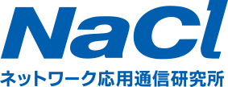
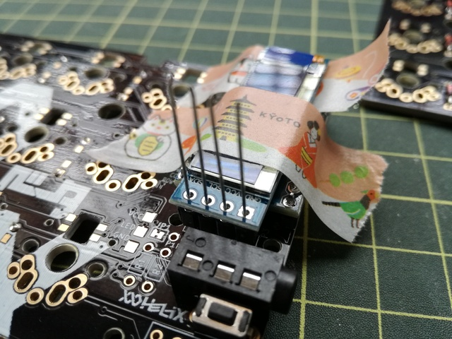

# NaClについて

前田 修吾  
株式会社ネットワーク応用通信研究所

## 自己紹介

* 名前: 前田修吾
* 肩書: 代表取締役社長
* 生年: 1975年
* 出身地: 愛知県
* 趣味: テキストエディタ開発、バイク、釣りなど

## 会社概要

* 社名: 株式会社ネットワーク応用通信研究所
* 設立: 2001年7月17日
* 拠点: 松江本社、東京支社
* 従業員数: 約40名 (松江30、東京10)
* 平均年齢: 約40歳

## ロゴ

## NaCl

* 英文社名: Network Applied Communication Laboratory Ltd.
* 通称: NaCl
  * 塩化ナトリウムの化学式
  * ほとんどの生物にとって生命維持に不可欠なナトリウム源
  * 「IT分野において必要不可欠な存在でありたい」

## NaClのPurpose

* プログラミングでよろこびを

## 業務内容

* ソフトウェアの開発、運用保守

## ハードウェアとソフトウェア

* ハードウェア
  * 物理的な機器
  * パソコン、ディスプレイ、キーボード、スマートフォン、タブレットなど
* ソフトウェア
  * ハードウェア上で動くプログラム
  * コンピュータを動かす

## ハードウェアの修正は難しい

## ソフトウェアの修正は簡単?

* 変えるのは簡単
* ちゃんと動くようにするのは難しい

## プログラミング言語

* プログラムを記述するための言語
* 人間が読み書きする

## フェロー: まつもとゆきひろ

## Ruby

* まつもとさんが作ったプログラミング言語
* 読みやすく書きやすい
  * コンピュータより人間の都合を重視
* TIOBE Indexで24位(2025年6月現在)
  * 最高8位(2016年)
* オープンソースソフトウェア

## オープンソースソフトウェア(OSS)

* 自由に利用・配布できる
* ソースコードを入手できる
* 改変・派生ができる
* 個人・グループ・用途に対する差別がない

## なぜOSSを使うか

* 0からすべてを開発するのは大変
* OSSを部品として使うことで開発が楽になる

## OSSへの還元

* OSSを使っていると、バグを見つけたり、機能が足りないことがある
* バグ修正や機能追加をOSSの開発元にフィードバックすると元のOSSに取り込まれることがある
* 本体に取り込まれるとメンテナンスされ続けるので当社やお客様にもメリットがある

## 受託開発

* お客さんのためのソフトウェアを開発する
  * 自社製品・サービスの開発ではない

## 契約形態

* 請負契約
  * あらかじめ決められた成果物を作成・納品する
* 準委任契約
  * 専門家として業務を遂行する
  * 作りたいものがはっきりしない場合に適している

## 開発工程

* 要件定義: システムに何が必要か決める
* 基本設計: プログラムがユーザーから見てどう動くかを設計する
* 詳細設計: プログラムの内部的な構造を設計する
* 単体テスト: プログラムの部品単位で動作をテストする
* 結合テスト: プログラムの部品を組み合わせてテストする
* システム: システムが必要な動作をすることをテストする

## 開発の進め方

* ウォーターフォール開発
  * 開発工程を一つずつ進めて全体を開発する
* アジャイル開発
  * 1〜2週間ごとに一部の機能に対して全工程を行う
  * できたものがほしいものと違ったら修正する

## 実績紹介

* https://www.netlab.jp/casestudy.html

## 裁量労働制

* 出社・退社の時間が決まっていない
* 自分の生活スタイルに合った働き方
* 成果をきちんと出すことが前提

## リモートワーク

* 出社・リモートワークのどちらかを選択できる
* チャット・ビデオ会議などを使ったコミュニケーション
* 業務の都合により出社が必要なこともある

## 社内サービス

* チャット (Teams)
* Wiki (esa)
* ファイル共有 (SharePoint)
* ソースコード管理 (GitHub)
* 課題管理 (Redmine)

## 全社会議

* 月1回オンラインで全社員参加の会議を行う
* 会社からのお知らせ
* グループディスカッション
* 昨年10月にはリアル開催(今年も開催予定)

## 物品購入・サービス導入の提案

* 購入したいもの、導入したいサービスがある場合、チャットの「提案」チャンネルで社員が提案できる
* 他の人の意見を聞いた上で、提案者が購入・導入するか決める
  * 多数決や役員の承認で決めるのではない
* 購入・導入実績
  * 運動促進サービス・ルンバ・加湿機・フリーベンド自販機など

## ランチ手当

* 月1回他の社員とランチに行くことを推奨
